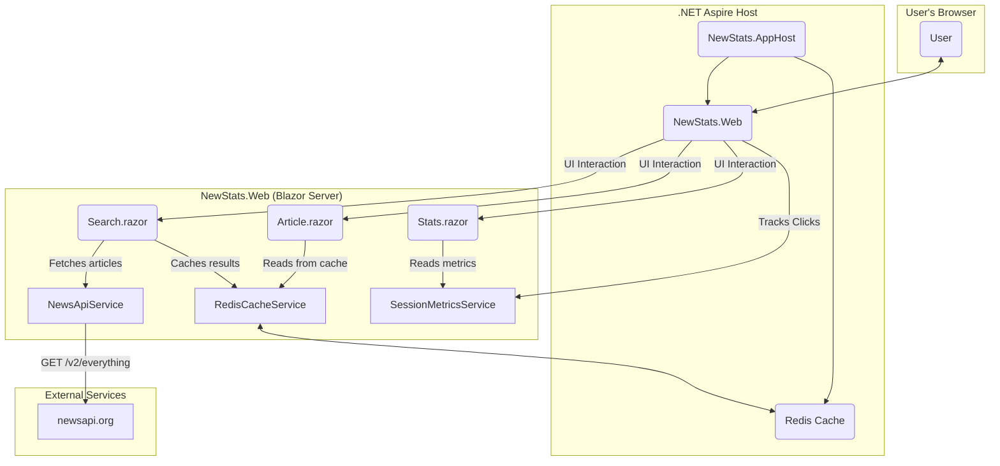

# NewStats: Blazor News Search & Metrics App

`NewStats` is a Blazor Server application built with .NET 10 where users can search for news articles and track interaction metrics like clicks per article within a session.

## Features

-   **Search**: Users can search for articles by keyword.
-   **Article Viewing**: Displays a list of articles from the search results. Clicking an article navigates to a detailed view.
-   **Metrics Tracking**: Counts how many times each article is clicked per session and displays the total click count in a dashboard.
-   **State Caching**: Uses Redis to cache search results and the last search query, restoring the state when the user returns to the search page.

## Architecture

This application is orchestrated by .NET Aspire, which manages the Blazor web application and the Redis cache. The Blazor application handles the user interface and business logic, interacting with the external NewsAPI for data and Redis for caching.

### Core Components

-   **NewStats.AppHost**: The .NET Aspire project responsible for orchestrating the other parts of the application.
-   **NewStats.Web**: The main Blazor Server web application. It contains all UI components, services, and application logic.
    -   **NewsApiService**: A service dedicated to fetching data from the external NewsAPI.
    -   **RedisCacheService**: Manages caching of search results and state in the Redis database.
    -   **SessionMetricsService**: A scoped service that tracks user clicks and metrics within a single session.
-   **Redis**: An in-memory data store used for high-performance caching.

## Tech Stack

-   .NET 10
-   Blazor Server
-   .NET Aspire
-   Redis
-   TailwindCSS