# NewsStats: Blazor WASM News Search & Metrics App

`NewsStats` is a Blazor WebAssembly application built with .NET 10 where users can search for news articles and track interaction metrics like clicks per article within a session.

## Features

- **Search**: Users can search for articles by keyword with optional date filtering.
- **Article Viewing**: Displays a grid of articles with images from search results. Clicking an article navigates to a detailed view.
- **Metrics Tracking**: Tracks how many times each article is clicked per session using event-driven architecture and displays statistics in real-time.
- **State Persistence**: Client-side state management preserves search results during navigation.
- **Distributed Caching**: API layer uses Redis to cache search results for improved performance.

## Architecture

This application uses a modern distributed architecture orchestrated by .NET Aspire. It consists of:

- **Blazor WebAssembly** frontend for rich client-side interactions
- **YARP reverse proxy** for unified routing and API gateway
- **ASP.NET Core API** backend with distributed caching
- **Redis** for high-performance result caching

```mermaid
graph TB
    %% Styling
    classDef userClass fill:#e1f5ff,stroke:#01579b,stroke-width:2px,color:#000
    classDef orchestrationClass fill:#fff9c4,stroke:#f57f17,stroke-width:2px,color:#000
    classDef proxyClass fill:#f3e5f5,stroke:#4a148c,stroke-width:2px,color:#000
    classDef frontendClass fill:#e8f5e9,stroke:#1b5e20,stroke-width:2px,color:#000
    classDef backendClass fill:#ffebee,stroke:#b71c1c,stroke-width:2px,color:#000
    classDef dataClass fill:#fce4ec,stroke:#880e4f,stroke-width:2px,color:#000
    classDef externalClass fill:#e0e0e0,stroke:#424242,stroke-width:2px,color:#000

    %% Layer 1: User
    User([👤 User Browser]):::userClass

    %% Layer 2: Entry Point
    User -->|HTTPS| Proxy[🌐 YARP Proxy<br/>NewsStats.Proxy]:::proxyClass

    %% Layer 3: Frontend
    Proxy -->|/* routes| WASM[📱 Blazor WASM<br/>NewsStats.Wasm]:::frontendClass

    %% Layer 4: Frontend Components
    WASM --> SearchPage[🔍 Search.razor]:::frontendClass
    WASM --> ArticlePage[📄 ArticleView.razor]:::frontendClass
    WASM --> StatsPage[📊 Stats.razor]:::frontendClass

    %% Layer 5: Frontend Services
    SearchPage -->|publishes| ClickEvent[📢 ArticleClickedEvent]:::frontendClass
    SearchPage -->|saves state| SearchState[💾 SearchStateService]:::frontendClass
    SearchPage -->|HTTP GET| ApiClient[🔌 NewsApiClient]:::frontendClass
    ArticlePage -->|reads state| SearchState
    ClickEvent -->|notifies| ClickState[📈 ArticlesClickState]:::frontendClass
    StatsPage -->|subscribes| ClickState

    %% Layer 6: API Gateway
    Proxy -->|/api/* routes| API[⚙️ ASP.NET Core API<br/>NewsStats.Api]:::backendClass
    ApiClient -->|/api/articles/search| API

    %% Layer 7: Backend Services
    API --> SearchEndpoint[🔎 Search Endpoint]:::backendClass
    SearchEndpoint -->|checks cache| Cache[(🗄️ Redis Cache)]:::dataClass
    SearchEndpoint -->|on miss| NewsService[📰 NewsApiService]:::backendClass

    %% Layer 8: External API
    NewsService -->|HTTP GET| External[🌍 NewsAPI.org]:::externalClass

    %% Orchestration (side reference)
    Orchestrator[☁️ .NET Aspire<br/>AppHost]:::orchestrationClass
    Orchestrator -.->|manages| Proxy
    Orchestrator -.->|manages| API
    Orchestrator -.->|manages| WASM
    Orchestrator -.->|provisions| Cache
```



### Core Components

#### Infrastructure

- **NewStats.AppHost**: .NET Aspire orchestration project managing all services, configuration, and service discovery.
- **NewsStats.Proxy**: YARP reverse proxy providing unified entry point, routing `/api/*` to backend and `/*` to frontend.
- **Redis**: In-memory distributed cache for API response caching.

#### Backend (NewsStats.Api)

- **Search Endpoint** (`/articles/search`): RESTful API endpoint with Redis caching.
- **NewsApiService**: Integration service for NewsAPI.org external data source.
- **Redis Distributed Cache**: Caches search results with configurable expiration.

#### Frontend (NewsStats.Wasm - Blazor WebAssembly)

- **Pages**:
  - `Search.razor`: Article search interface with keyword and date filtering.
  - `ArticleView.razor`: Detailed article view with full content.
  - `Stats.razor`: Real-time session metrics dashboard.
- **Services**:
  - **NewsApiClient**: HTTP client wrapper for API communication.
  - **SearchStateService**: Scoped service for UI state persistence during navigation.
  - **ArticleClickedEvent**: Singleton event bus for article click notifications.
  - **ArticlesClickState**: Scoped service tracking click metrics with event-driven updates.

## Tech Stack

- **.NET 10**: Latest .NET platform
- **Blazor WebAssembly**: Client-side SPA framework
- **ASP.NET Core**: Backend API
- **YARP 2.2.0**: Reverse proxy and API gateway
- **.NET Aspire**: Cloud-native orchestration and service discovery
- **Redis**: Distributed caching
- **Tailwind CSS**: Utility-first styling framework
- **NewsAPI.org**: External news data source

## Architecture Patterns

### Event-Driven State Management

The application uses a clean event-driven architecture for metrics tracking:

- **ArticleClickedEvent**: Mediator pattern for decoupling UI from state management
- **ArticlesClickState**: Observer pattern with `OnStateChanged` event for reactive UI updates
- **SearchStateService**: State preservation pattern for navigation continuity

### Distributed Caching Strategy

- **API Layer**: Redis caching for external API responses (reduces latency and API costs)
- **Client Layer**: In-memory state services for UI-level caching (instant navigation)

### Routing & Proxy

- **YARP Configuration**: Routes `/api/*` to backend, `/*` to frontend SPA
- **Service Discovery**: Aspire resolves service endpoints dynamically
- **Path Transforms**: Strips `/api` prefix before forwarding to backend

## Getting Started

### Prerequisites

- .NET 10 SDK
- Docker (for Redis)
- NewsAPI.org API key

### Setup

1. Clone the repository
2. Set up user secrets for NewsAPI key:
   ```bash
   cd NewStats.AppHost
   dotnet user-secrets set "NewsApiKey" "your-api-key-here"
   ```
3. Run with Aspire:
   ```bash
   aspire run
   ```
   Or:
   ```bash
   dotnet run --project NewStats.AppHost
   ```

### Configuration

The application uses .NET Aspire for configuration and orchestration:

- **NewsApiKey**: Stored in user secrets, passed to API via environment variables
- **Redis**: Automatically provisioned and configured by Aspire
- **Service Discovery**: YARP uses Aspire service discovery to resolve backend endpoints

### Project Structure

```
NewsStats/
├── NewStats.AppHost/           # Aspire orchestration
├── NewStats.ServiceDefaults/   # Shared service configurations
├── NewsStats.Proxy/            # YARP reverse proxy
├── NewsStats.Api/              # ASP.NET Core backend
│   ├── Hubs/                   # (Removed - SignalR no longer used)
│   ├── Models/
│   └── Services/
└── NewsStats.Wasm/             # Blazor WebAssembly frontend
    ├── Pages/
    ├── Services/
    └── Models/
```

## Key Design Decisions

### Why Blazor WebAssembly over Server?

- Better scalability (client-side rendering)
- Reduced server load
- Works well with API-first architecture

### Why YARP Proxy?

- Single entry point for client
- No hardcoded URLs in frontend
- Easy to add authentication, rate limiting, etc.
- Simplifies CORS management

### Why Event-Driven State?

- Decouples UI components from state management
- Enables real-time reactive updates
- Makes testing easier
- Follows SOLID principles

### Why Redis Caching?

- Reduces external API calls and costs
- Improves response times significantly
- Enables horizontal scaling of API layer
